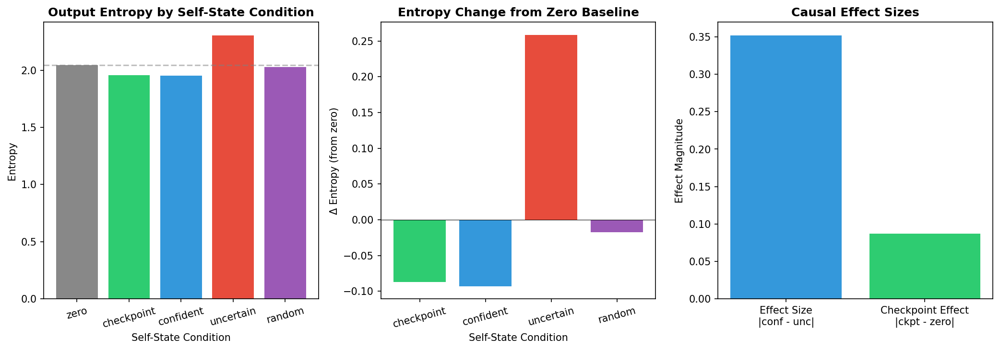

# Frozen-Weight Causal Test Results

**Pipeline phases:** 3 (shakespeare), 5 (openwebtext)
**Script:** `scripts/analysis/frozen_test_auto.py`
**Output:** `out/{dataset}/frozen_test_results.json`

## What We Ran

With weights frozen, we manually steer the self-state in different directions and measure the effect on model entropy:

1. **Zero** — baseline (self-state = 0)
2. **Checkpoint** — learned state from training
3. **Confident** — top 5 dimensions that reduce entropy
4. **Uncertain** — top 5 dimensions that increase entropy
5. **Random** — 50 random directions, norm-matched

## What We Got

**Shakespeare:**
| Condition | Δ entropy | Sign consistency |
|-----------|-----------|------------------|
| Checkpoint | -0.087 | — |
| Confident | -0.093 | 100% |
| Uncertain | +0.259 | 100% |
| Random (n=50) | +0.040 ± 0.10 | 44% |

**Effect size:** 0.35

**OpenWebText:**
| Condition | Δ entropy | Sign consistency |
|-----------|-----------|------------------|
| Checkpoint | -0.059 | — |
| Confident | -0.004 | 60% |
| Uncertain | +0.324 | 100% |
| Random (n=50) | +0.044 ± 0.09 | 36% |

**Effect size:** 0.33

## Key Finding

Learned directions produce consistent, predictable effects on entropy. Random directions of the same magnitude do not. The self-state has found structure that the weights have learned to use.

**Threshold:** effect size > 0.3 indicates meaningful causal leverage.

## Data Files

- `out/shakespeare/frozen_test_results.json` — full results with confident/uncertain dims
- `out/openwebtext/frozen_test_results.json` — generalization results
- `figures/frozen-weight-test.png` — visualization
