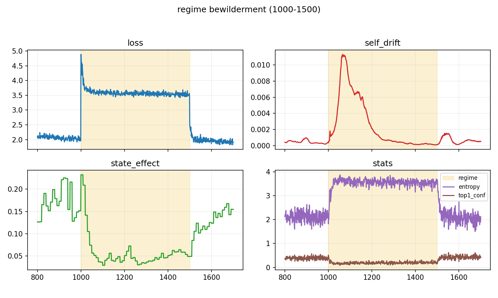
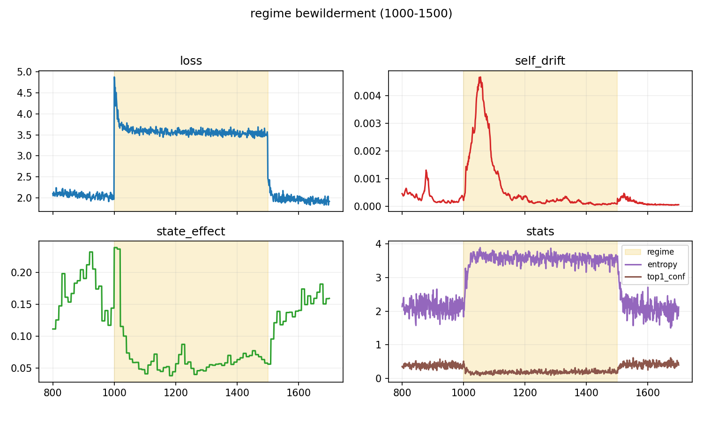
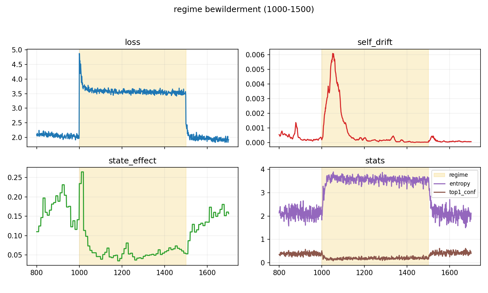

# Memory Architecture Results

**Pipeline phase:** 6 (memory)
**Suite:** `configs/suites/memory_buffer_grid.yaml`
**Output:** `out/memory/`

## What We Ran

Compared two memory architectures for the self-state:

1. **EMA (Exponential Moving Average)** — state = 0.9 × old + 0.1 × new
2. **Buffer** — ring buffer of past states with attention-weighted retrieval

Buffer configurations tested: L=32, L=64, L=128 (buffer length), stride=5, 10, 20.

## What We Got

| EMA baseline | Buffer (L=64) | Buffer (L=128) |
|:------------:|:-------------:|:--------------:|
|  |  |  |

**Summary statistics:**

| Mode | self_drift_Δ | state_effect_Δ |
|------|--------------|----------------|
| EMA (decay=0.1) | 0.0022 | 0.121 |
| Buffer L=32 | 0.0004 | 0.113 |
| Buffer L=64 | 0.0004-0.0007 | 0.103-0.121 |
| Buffer L=128 | 0.0007 | 0.106 |

## Key Finding

**Stability vs control tradeoff:** Buffer memory shows ~5x lower self_drift than EMA, indicating more stable state tracking. The state gets anchored to its history, which helps it resist perturbation but may reduce rapid adaptation.

| Memory type | Stability | Control leverage |
|-------------|-----------|------------------|
| EMA | Lower | Higher |
| Buffer (longer) | Higher | Lower |

## Data Files

- `out/memory/memory_buffer_summary.csv` — cross-architecture comparison
- `out/memory/mem-ema-*/regime_deltas.csv` — EMA run details
- `out/memory/mem-buf-*/regime_deltas.csv` — buffer run details
