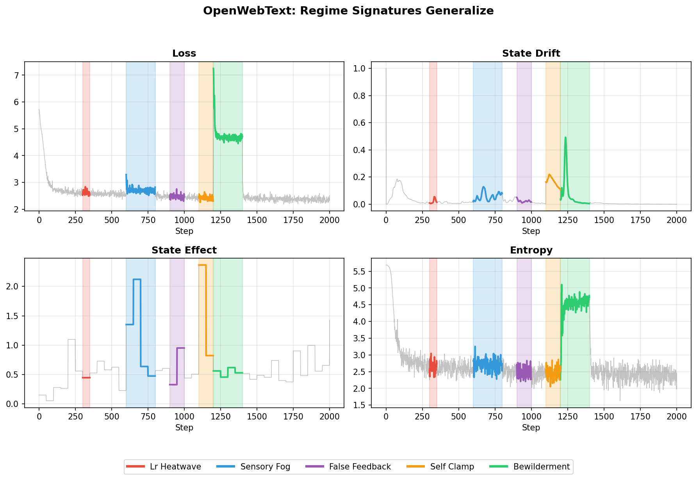

# OpenWebText Generalization Results

**Pipeline phase:** 4 (openwebtext)
**Suite:** `configs/suites/openwebtext_progress.yaml`
**Output:** `out/openwebtext/`

## What We Ran

Replicated the core Shakespeare experiments on OpenWebText (BPE tokenization, different domain) to verify findings generalize.

Same perturbation regimes:
- lr_heatwave, sensory_fog, false_feedback, self_clamp, bewilderment

## What We Got

**Frozen-weight test:**

| Metric | Shakespeare | OpenWebText |
|--------|-------------|-------------|
| Effect size | 0.35 | 0.33 |
| Checkpoint Δentropy | -0.087 | -0.059 |
| Uncertain Δentropy | +0.259 | +0.324 |

Both exceed the 0.3 threshold for meaningful causal leverage.

**Regime signatures:**

The same distinct patterns appear: bewilderment causes entropy spike, lr_heatwave causes drift spike, etc.

## Key Finding

**All core findings generalize:**
1. Self-state develops meaningful structure (effect size > 0.3)
2. Learned directions produce consistent entropy effects
3. Different regimes produce distinct signatures
4. State channels improve regime classification

The mechanism isn't Shakespeare-specific or character-level-specific.

## Data Files

- `out/openwebtext/frozen_test_results.json` — causal test results
- `out/openwebtext/regimes-all/regime_deltas.csv` — regime statistics
- `figures/openwebtext/regime-reactions.png` — regime comparison plot
