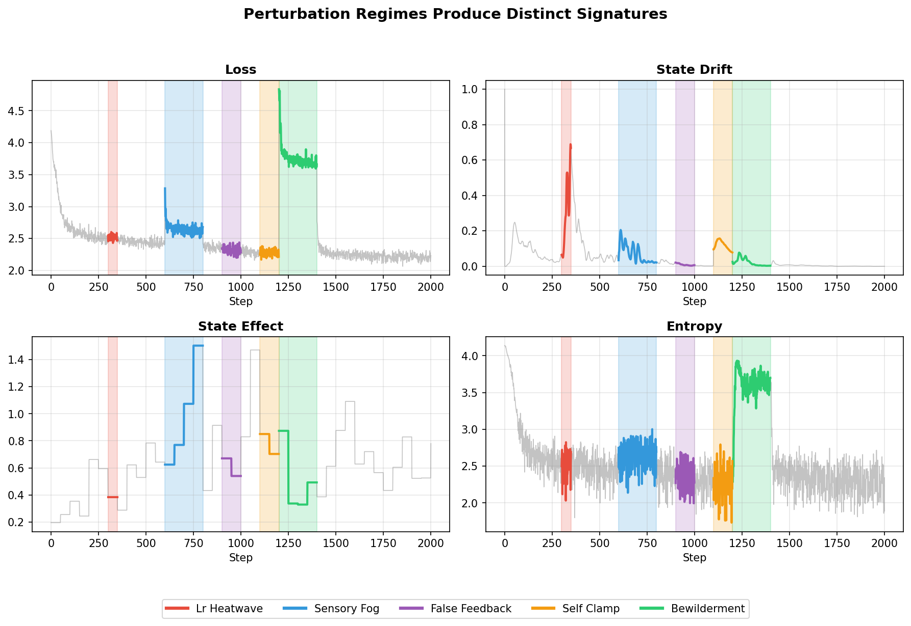

# Shakespeare Core Results

**Pipeline phase:** 2 (shakespeare)
**Suite:** `configs/suites/shakespeare_core.yaml`
**Output:** `out/shakespeare/`

## What We Ran

Training runs on Shakespeare character-level data with self-state enabled, applying 5 perturbation regimes:

| Regime | Window | What it does |
|--------|--------|--------------|
| lr_heatwave | 300-350 | 10x learning rate spike |
| sensory_fog | 600-800 | Mask 50% of input tokens |
| false_feedback | 900-1000 | Bias statistics fed to self-state |
| self_clamp | 1100-1200 | Freeze self-state updates |
| bewilderment | 1200-1400 | Corrupt 50% of target labels |

## What We Got

Each regime produces a distinct signature in the state-specific channels:

**Regime deltas (self-regimes run):**

| Regime | loss_Δ | entropy_Δ | self_drift_Δ | state_effect_Δ |
|--------|--------|-----------|--------------|----------------|
| bewilderment | +1.65 | +1.48 | +0.030 | -0.18 |
| lr_heatwave | -0.01 | -0.05 | +0.27 | -0.005 |
| self_clamp | -0.03 | -0.02 | +0.21 | -0.19 |
| sensory_fog | +0.26 | +0.27 | -0.002 | +0.07 |
| false_feedback | -0.05 | +0.01 | -0.002 | +0.01 |

## Key Finding

The self-state channels (self_drift, state_effect) provide discriminative signal beyond loss/entropy. With just loss, entropy, and confidence: 77-80% regime classification accuracy. Add state channels: **100% accuracy**.

## Data Files

- `out/shakespeare/self-regimes/regime_deltas.csv` — per-regime statistics
- `out/shakespeare/self-regimes/reaction_log.jsonl` — full step-by-step log
- `out/shakespeare/self-analysis/ckpt.pt` — checkpoint for frozen test
